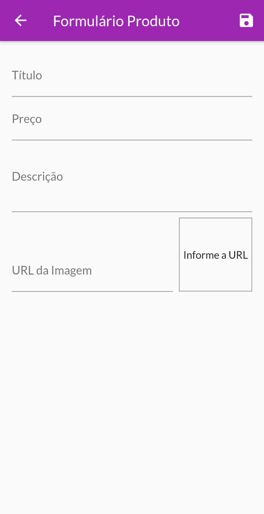

# Loja

Projeto de uma loja utilizando Flutter.

## Sobre

Projeto feito para aprendizado e aperfeiçoamento de alguns conceitos como:
- Navegação com rotas
- Sistema de autenticação utilizando uma API e persistência dos dados de login utilizando a biblioteca do 'shared_preferences'
- Carregar dados de uma API utilizando requisições http
- Gerenciamento de estados
- Implementação do InheritedWidget (Carrinho) com a biblioteca do 'provider'

## Bibliotecas utilizadas

- 'provider' biblioteca para implementar o carrinho, mantendo as informações ao longo das telas.
- 'cached_network_image' biblioteca utilizada para economizar o consumo de dados ao carregar as imagens.
- 'flutter_cache_manager' biblioteca para gerenciar a cache e melhorar o desempenho do aplicativo.
- 'intl' biblioteca para formatar as datas para o formato brasileiro.
- 'http' biblioteca utilizada para realizar as requisições http (autenticação, produtos).
- 'shared_preferences' biblioteca para guardar poucas informações na memória interna do dispositivo.

## Screenshots

  
  
  
  
  
  
  
  

